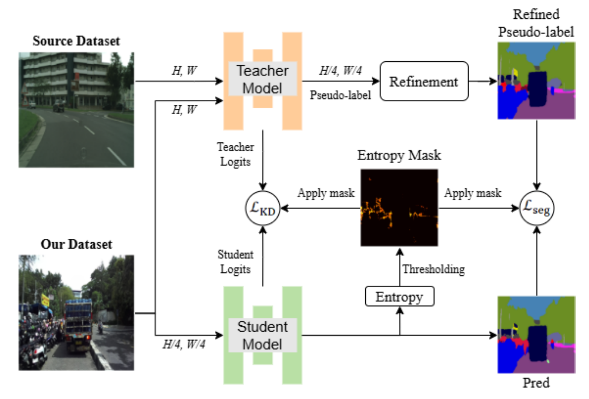
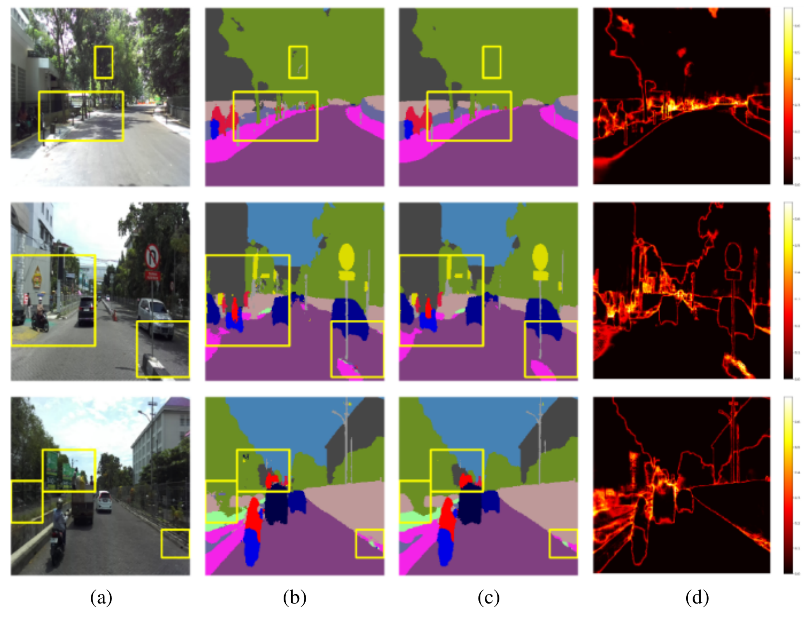

# Edge-Aware Distilled Segmentation with Pseudo-Label Refinement

Official code for the paper **"Edge-aware distilled segmentation with pseudo-label refinement for autonomous driving perception"**, published in the *IAES International Journal of Robotics and Automation (IJRA)*, Vol. 14, No. 4, 2025.

**Novelio Putra Indarto, Oskar Natan, Andi Dharmawan** · Universitas Gadjah Mada

[](https://ijra.iaescore.com/index.php/IJRA/article/view/21108)
[](https://doi.org/10.11591/ijra.v14i4.pp528-538)

<p align="center">
  
  <br><em>Overall pipeline: teacher pseudo-labels → DenseCRF refinement → entropy-masked distillation into a lightweight student.</em>
</p>

## Overview

This work trains compact semantic segmentation models for edge devices **without manual labels**. A large teacher labels unlabeled driving images, the labels are cleaned up, and a small student learns from them:

1. **Pseudo-labeling:** a SegFormer-B5 teacher (Cityscapes-pretrained, 19 classes) predicts logits and hard pseudo-labels for every image.
2. **DenseCRF refinement:** a fully connected CRF sharpens boundaries and improves spatial consistency of the pseudo-labels.
3. **Entropy masking:** pixels whose normalized teacher entropy exceeds a threshold τ are ignored during training.
4. **Knowledge distillation:** an EfficientNet + U-Net student is trained with `CE + Dice` on refined labels plus a temperature-scaled KL term on teacher logits.

<p align="center">
  
  <br><em>(a) input, (b) teacher pseudo-labels, (c) DenseCRF-refined labels, (d) teacher entropy map. Yellow boxes highlight regions for comparison.</em>
</p>

## Results

mIoU (%) as reported in the paper (Tables 1–3). F1 scores and full ablations are in the paper.

| Student backbone | Params | Pseudo-labels | + DenseCRF | + DenseCRF + KD + entropy mask | FPS (1 / 4 CPU cores) |
|---|---|---|---|---|---|
| EfficientNet-B0 | 5.8 M | 81.89 | 82.57 | 82.90 (τ = 0.45) | 15.7 / 42.0 |
| EfficientNet-B3 | 12.5 M | 81.52 | 82.75 | 82.95 (τ = 0.45) | 11.1 / 28.8 |
| EfficientNet-B5 | 30.0 M | 82.24 | 82.79 | 83.00 (τ = 0.35) | 7.6 / 20.1 |
| EfficientNet-B7 | 65.2 M | 82.70 | 83.21 | 83.78 (τ = 0.25) | 4.7 / 13.4 |

CPU benchmarks use 256×256 inputs on an AMD Ryzen Threadripper PRO 7965WX limited to 1–4 cores.

## Installation

```bash
git clone https://github.com/NovelioPI/distilled-self-learning-segmentation.git
cd distilled-self-learning-segmentation

pip install torch torchvision pytorch-lightning segmentation-models-pytorch timm \
            transformers albumentations numpy pillow tqdm tensorboard
pip install git+https://github.com/lucasb-eyer/pydensecrf.git   # DenseCRF refinement
pip install thop py-cpuinfo psutil                              # edge benchmarking
```

## Data

The UGM urban driving dataset (Indonesia) cannot be released publicly due to privacy restrictions; it is available on request from the corresponding author (Oskar Natan). To use your own images, arrange them like this:

```
<DATA_ROOT>/
├── camera/rgb/*.png                          # raw images
├── camera/seg/pseudo_labels_segformer_b5/    # created by the scripts below
│   ├── logits/*.npy                          # teacher logits
│   ├── pseudo_labels/*.png                   # teacher hard labels
│   └── refined-1.0_pseudo_labels/*.png       # DenseCRF-refined labels
├── train.json                                # {"id": "<image stem>", ...}
├── val.json
└── test.json
```

Paths are hard-coded at the top of each script (`/media/esr/ssd0/...`); change them to your `<DATA_ROOT>` before running.

## Usage

```bash
# 1. Generate teacher logits and pseudo-labels (SegFormer-B5 from Hugging Face)
python generate_pseudo.py

# 2. Refine pseudo-labels with DenseCRF
python refine_pseudo.py

# 3. Train the student (edit the hyperparameter grid under __main__)
python train.py

# 4. Benchmark trained checkpoints on CPU (set cpu_core in the script)
python test_edge.py
```

`train.py` runs every combination of the lists defined in its `__main__` block (`ENCODER`, `USE_KD`, `T`, `KD_WEIGHT`, `ENTROPY_THRESHOLD`, `USE_REFINEMENT`, …). Defaults: `timm-efficientnet-b0` U-Net, 256×256 input, batch 12, AdamW (lr 1e-3), T = 2.0, KD weight 0.001, τ = 0.35, up to 50 epochs with early stopping. Logs go to `logs/` (TensorBoard) and the best checkpoint to `saved_models/`.

Baselines used for comparison: `train_mean_teacher.py` (Mean Teacher) and `train_pseudoseg.py` (PseudoSeg). `visualize.ipynb` reproduces the qualitative figures.

## Repository structure

```
├── generate_pseudo.py      # teacher inference → logits + pseudo-labels
├── refine_pseudo.py        # DenseCRF refinement
├── train.py                # student training (KD + entropy masking)
├── test_edge.py            # CPU latency / FPS / RAM / FLOPs benchmark
├── utils.py                # losses, metrics, entropy, CRF, model builder
├── models/                 # teacher (SegFormer-B5) and student definitions
├── dataset/                # UGM and Cityscapes data modules
├── mean_teacher/, pseudoseg/  # baseline methods
├── model_performance_*.json   # edge benchmark results (1–4 cores)
└── visualize*.ipynb        # figures
```

## Citation

```bibtex
@article{indarto2025edgeaware,
  title   = {Edge-aware distilled segmentation with pseudo-label refinement for autonomous driving perception},
  author  = {Indarto, Novelio Putra and Natan, Oskar and Dharmawan, Andi},
  journal = {IAES International Journal of Robotics and Automation (IJRA)},
  volume  = {14},
  number  = {4},
  pages   = {528--538},
  year    = {2025},
  doi     = {10.11591/ijra.v14i4.pp528-538}
}
```

## Acknowledgements

Built on [segmentation_models.pytorch](https://github.com/qubvel-org/segmentation_models.pytorch), [Hugging Face Transformers](https://huggingface.co/nvidia/segformer-b5-finetuned-cityscapes-1024-1024) (SegFormer), [PyTorch Lightning](https://lightning.ai/), and [pydensecrf](https://github.com/lucasb-eyer/pydensecrf).
